1.
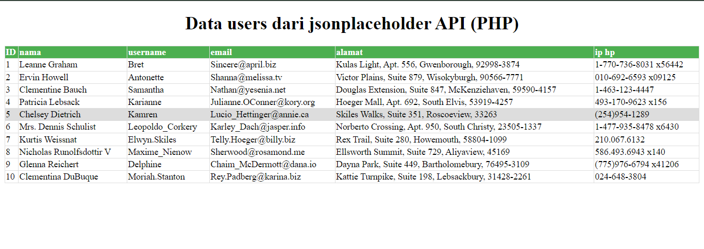
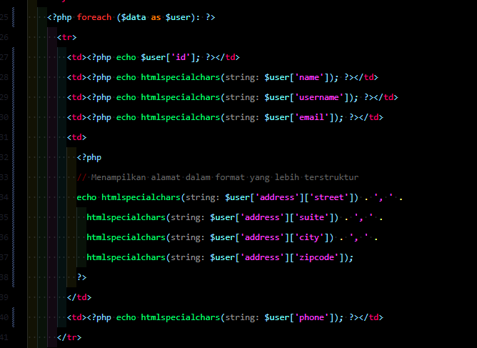
di atas merupakan hasil dari pengimplementasian api menggunakan users yang memanggil informasi dari users tersebut
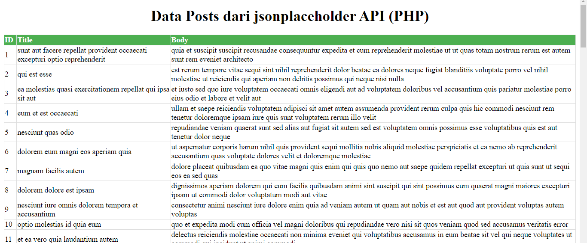
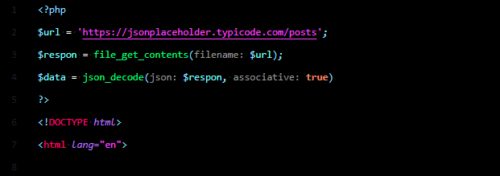
gambar di atas merupakan hasil dari pengimplementasian api menggunakan post yang memanggil id, title, body menggunakan php.
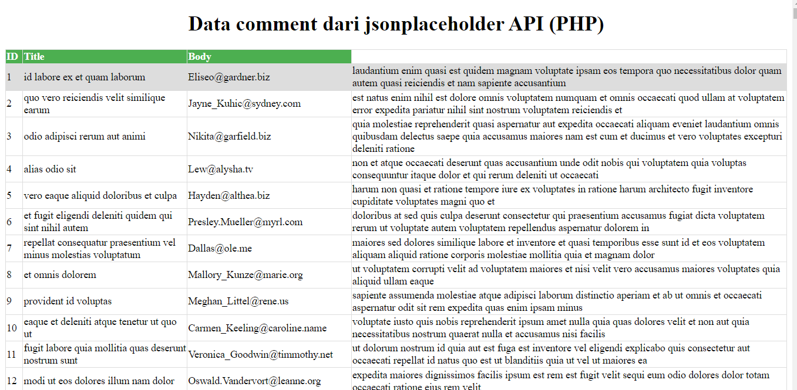
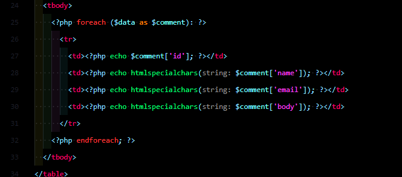
gambar di atas merupakan hasil dari pengimplementasian api yang Comment yang sedikit berbeda dengan post, contoh di atas berguna untuk menampilkan data email di dalam php.
2.
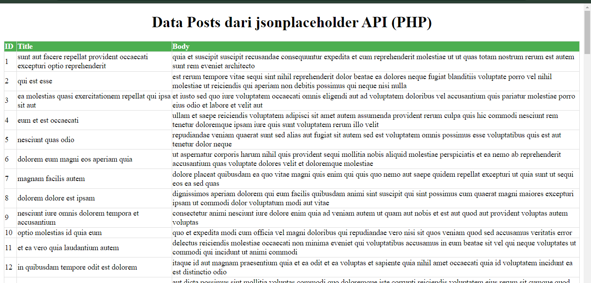
pada gambar di atas merupakan penampilan data yang belum terintegrasi dengan filter dan hanya menampilkan data nya saja pada php.
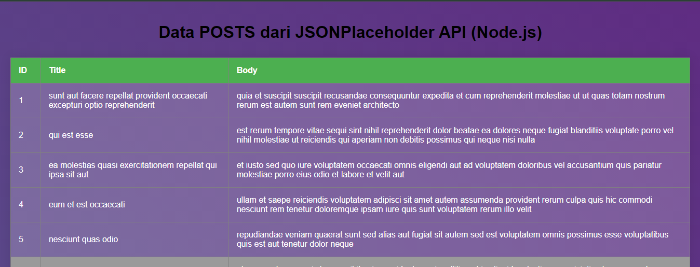
gambar di atas adalah gambar dari sebuah table yang belum terimplementasikan sebuah filter id dan title pada js.
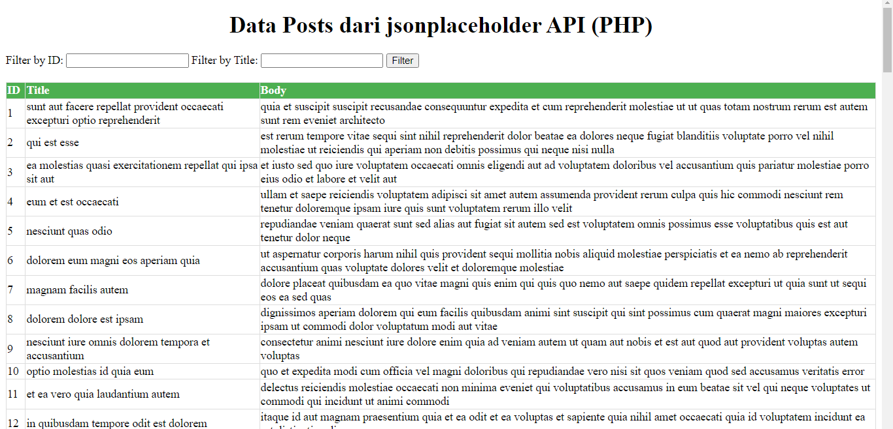
gambar di atas merupakan hasil dari sesudah pengimplementasian filter input ID dan  Title pada php.
untuk code php nya di bawah:
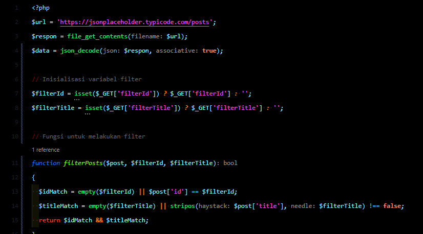
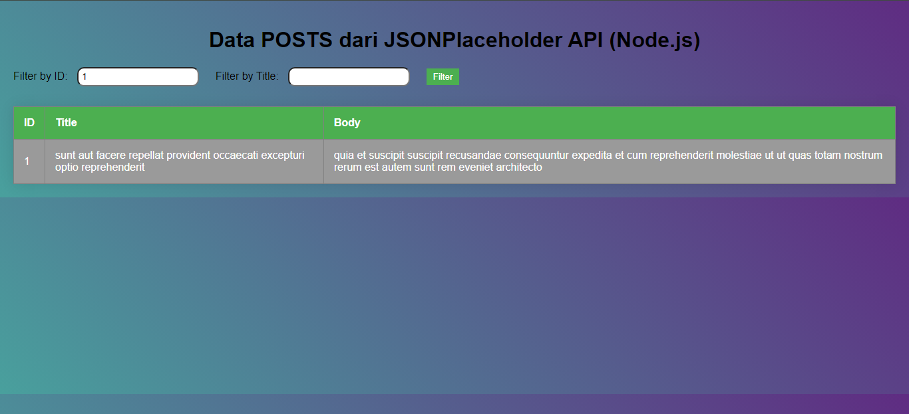
gambar di atas adalah gambar dari sebuah table yang telah terimplementasikan sebuah filter id dan title, jadi di table tersebut dapat menginput sebuah filter yang di inginkan. pada js.
untuk code js nya di bawah:
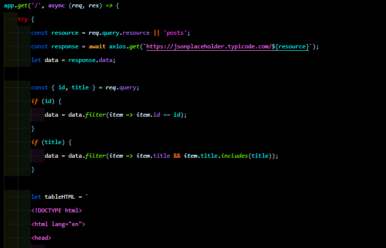
3.
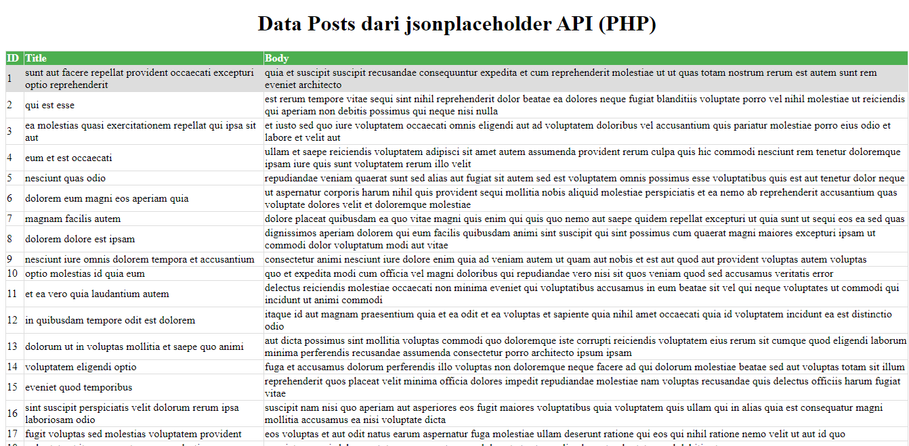
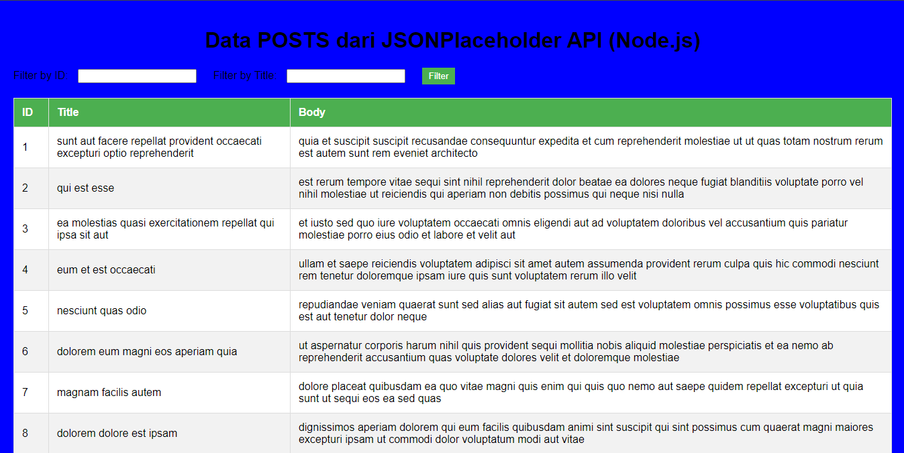
pada gambar di atas adalah hasil table yang saya buat sebelum sedikit dimodifikasi yang di pada gambar terlihat berantak kan serta monoton untuk di lihat.
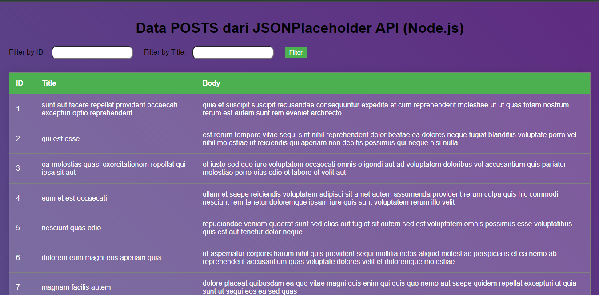

gambar diatas adalah shasil dari modifikasi table yang saya lakukan, untuk modifikasi nya sedikit lebih bagus dan antara warna nya tidak saling bentrok dan lebih enak untuk di lihat. jikalau di scroll ke bawah bacground warna nya akan berubah.